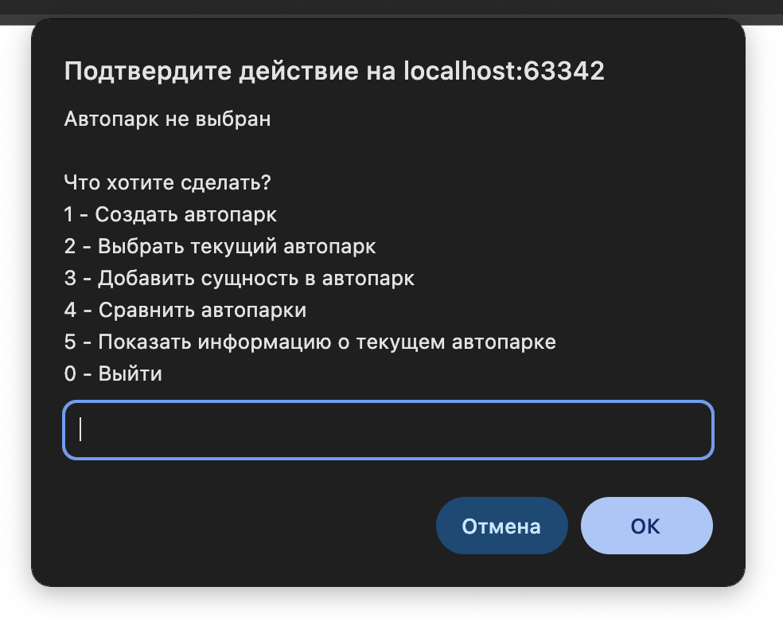

# 🚗 Автопарк Менеджер

Консольное браузерное приложение для управления автопарками, сотрудниками и филиалами.

## 📌 Описание

Этот проект — простой и интуитивный симулятор автопарков. Он позволяет:

- Создавать автосалоны (автопарки)
- Добавлять в них машины (легковые, грузовые)
- Назначать сотрудников (водителей и рабочих)
- Создавать иерархию автосалонов через автосалон
- Сравнивать автосалоны по количеству машин и сотрудников
- Просматривать подробную информацию о текущем автопарке

> 💡 Интерфейс построен на `prompt` / `alert`, работает прямо в браузере.

---

## 🚀 Как запустить

1. Открой `index.html` в браузере.
2. В браузере появится главное меню.
3. Следуй инструкциям.

---

## 🧱 Структура

- `AutoPark` — автосалон
- `Car` → `PassengerCar` / `Truck` — автомобили
- `Person` → `Driver` / `Worker` — персонал
- `add()` — добавление сущностей
- `main()` — основное меню

---

## 🖼️ Пример интерфейса

---

## 📖 Примеры возможностей

- Добавить водителя с категорией прав "C"
- Назначить другой автопарк как автосалон
- Вывести списки машин, персонала и автосалонов
- Сравнить два автосалона по количеству машин и персонала

---

